# Architecture Documentation

## Overview

`llm-benchmarking-py` is a modular Python library designed to benchmark LLM code generation capabilities across multiple computational domains. This document provides comprehensive architectural views of the system using Mermaid diagrams.

## Table of Contents

- [High-Level Architecture](#high-level-architecture)
- [Module Structure](#module-structure)
- [Component Diagram](#component-diagram)
- [Data Flow](#data-flow)
- [Class Relationships](#class-relationships)
- [Test Architecture](#test-architecture)
- [Deployment View](#deployment-view)
- [Design Patterns](#design-patterns)
- [Performance Considerations](#performance-considerations)

## High-Level Architecture

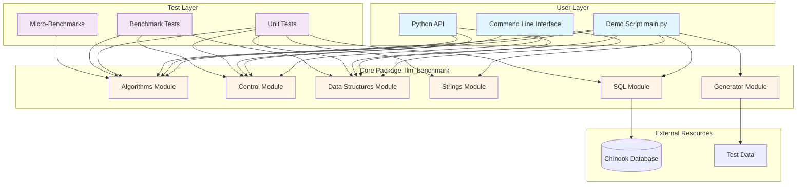

## Module Structure

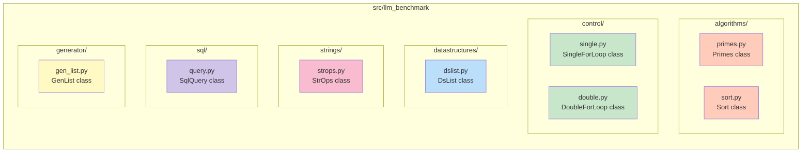

## Component Diagram

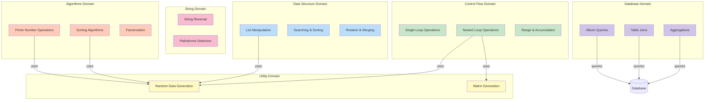

## Data Flow

### Typical Benchmark Workflow

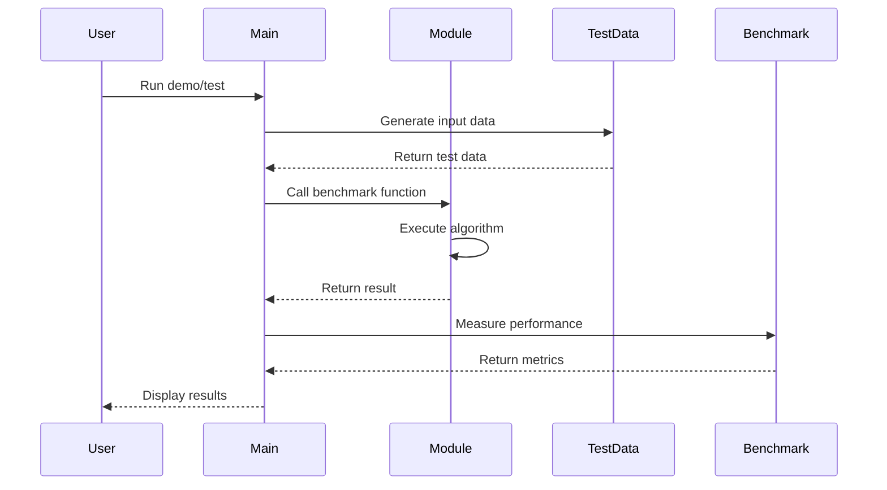

### SQL Query Flow

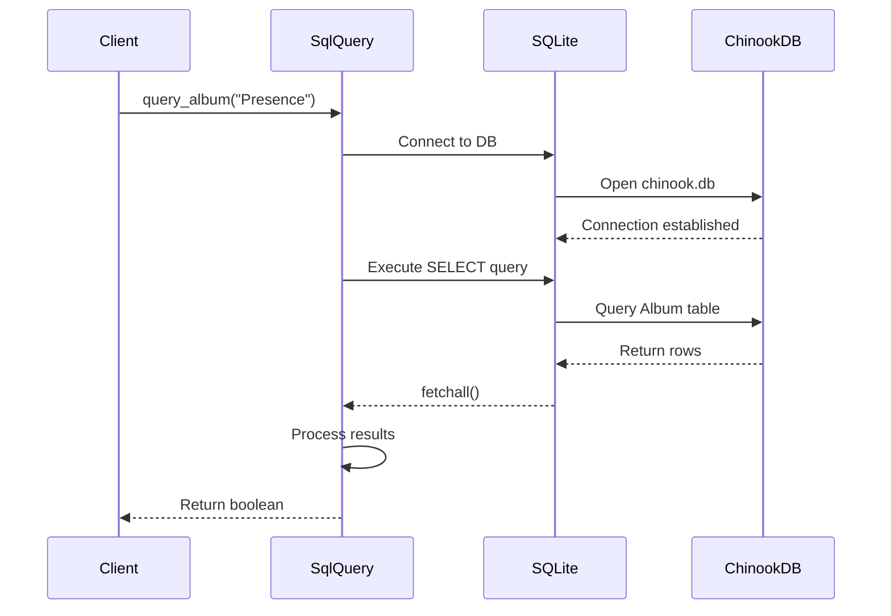

### Test Execution Flow

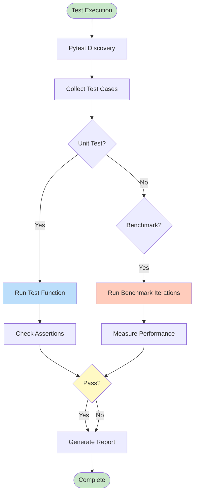

## Class Relationships

```mermaid
classDiagram
    class Primes {
        <<static>>
        +is_prime(n: int) bool
        +is_prime_ineff(n: int) bool
        +sum_primes(n: int) int
        +prime_factors(n: int) List~int~
    }
    
    class Sort {
        <<static>>
        +sort_list(v: List) void
        +dutch_flag_partition(v: List, pivot: int) void
        +max_n(v: List, n: int) List
    }
    
    class SingleForLoop {
        <<static>>
        +sum_range(n: int) int
        +max_list(v: List) int
        +sum_modulus(n: int, m: int) int
    }
    
    class DoubleForLoop {
        <<static>>
        +sum_square(n: int) int
        +sum_triangle(n: int) int
        +count_pairs(v: List) int
        +count_duplicates(v1: List, v2: List) int
        +sum_matrix(m: List~List~) int
    }
    
    class DsList {
        <<static>>
        +modify_list(v: List) List
        +search_list(v: List, n: int) List~int~
        +sort_list(v: List) List
        +reverse_list(v: List) List
        +rotate_list(v: List, n: int) List
        +merge_lists(v1: List, v2: List) List
    }
    
    class StrOps {
        <<static>>
        +str_reverse(s: str) str
        +palindrome(s: str) bool
    }
    
    class SqlQuery {
        <<static>>
        +query_album(name: str) bool
        +join_albums() list
        +top_invoices() list
    }
    
    class GenList {
        <<static>>
        +random_list(size: int, max: int) List~int~
        +random_matrix(rows: int, cols: int, max: int) List~List~
    }
    
    note for Primes "O(√n) optimized prime checking\nSieve of Eratosthenes for sum_primes"
    note for Sort "In-place sorting algorithms\nDutch flag partitioning"
    note for DoubleForLoop "Nested loop patterns\nO(n²) complexity operations"
    note for SqlQuery "Uses SQLite with Chinook DB\nDemonstrates SQL operations"
```

## Test Architecture

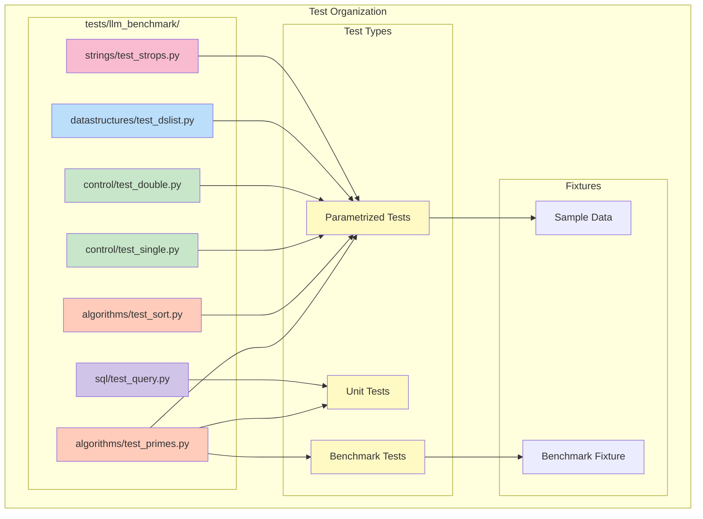

### Test Coverage Map

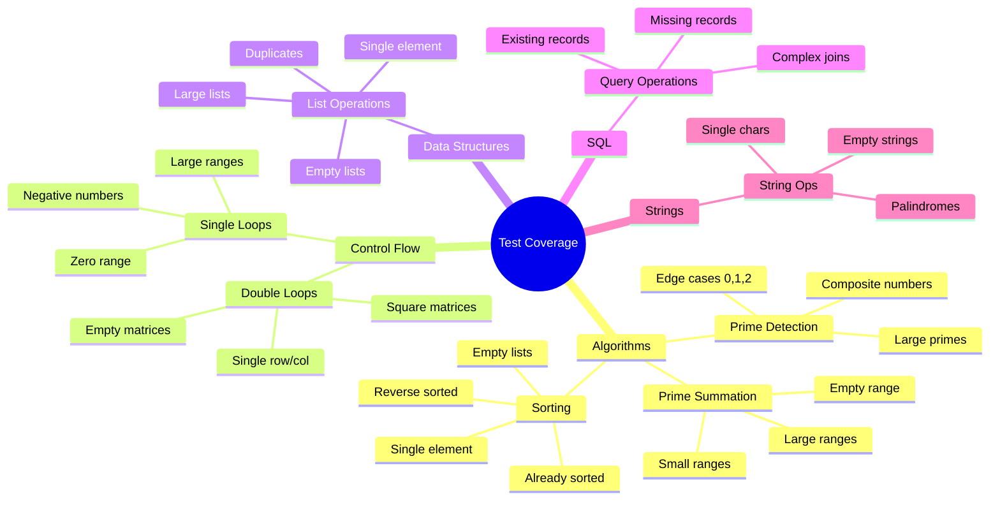

## Deployment View

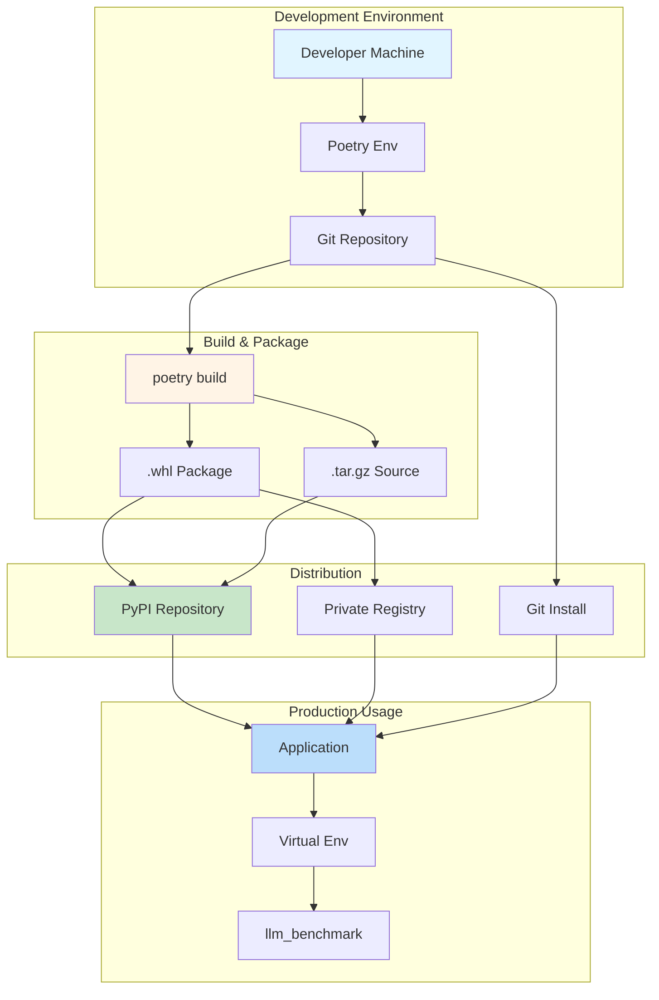

## Design Patterns

### Static Method Pattern

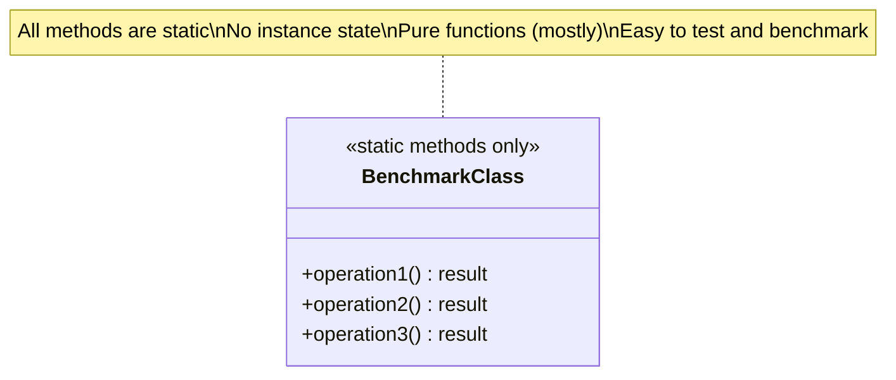

**Rationale:**
- No need for instance state
- Functions are stateless and pure
- Easy to call from tests and benchmarks
- Simple API: `ClassName.method(args)`

### Module Organization Pattern

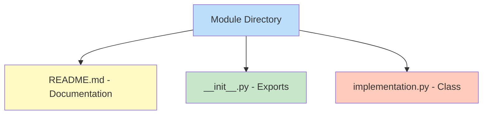

**Structure:**
- Each module has its own directory
- README.md documents the module
- `__init__.py` exports public classes
- Implementation files contain logic

### Test Mirroring Pattern

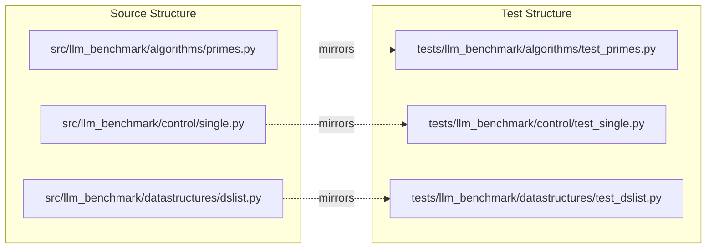

## Performance Considerations

### Complexity Overview

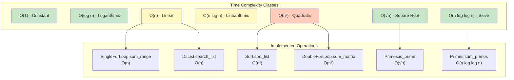

### Optimization Journey

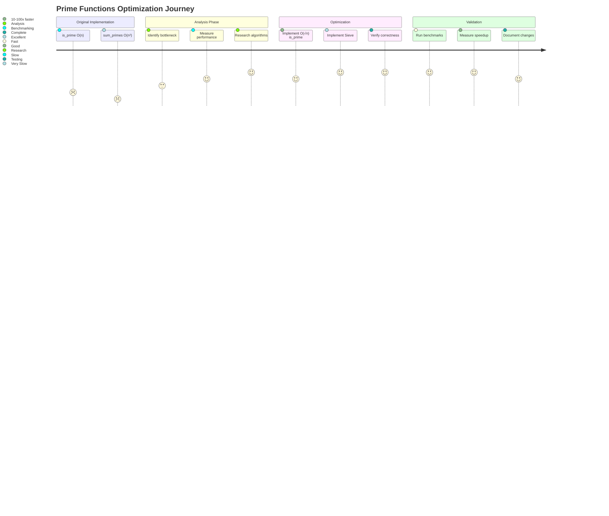

## Performance Hotspots

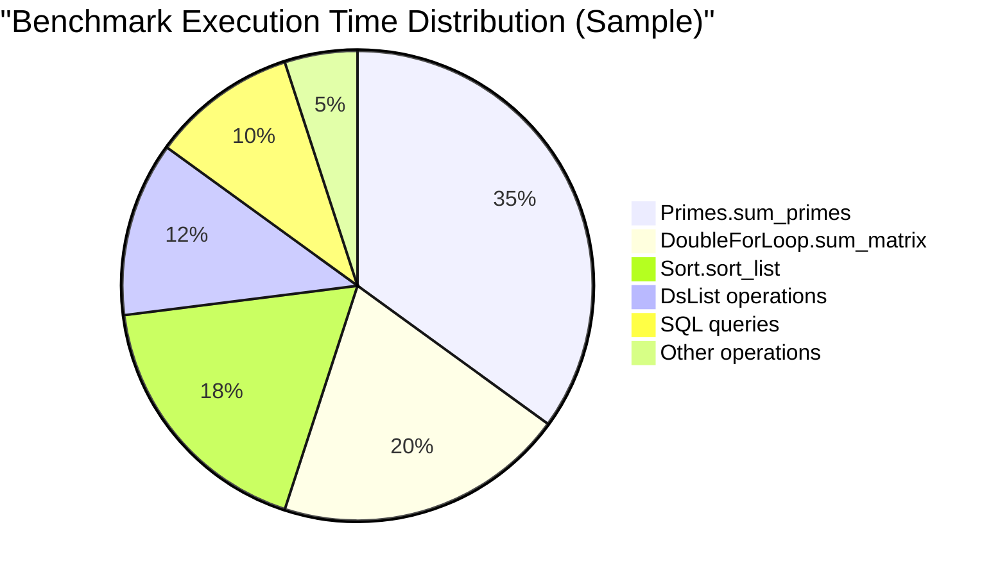

## Design Decisions

### Key Architectural Decisions

| Decision | Rationale | Trade-offs |
|----------|-----------|------------|
| Static methods only | No need for state, simpler API | Less flexibility for inheritance |
| Separate modules | Clear separation of concerns | More files to manage |
| Type hints required | Better IDE support, documentation | Slight verbose overhead |
| Poetry for dependencies | Modern, reproducible builds | Learning curve for new users |
| Pytest for testing | Industry standard, excellent plugins | Additional dependency |
| In-place vs. copy | Some methods modify, some return new | Must document behavior clearly |

### Why These Choices?

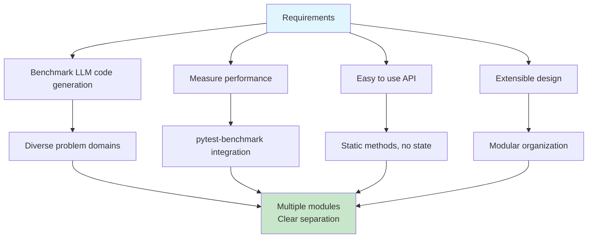

## Module Dependencies

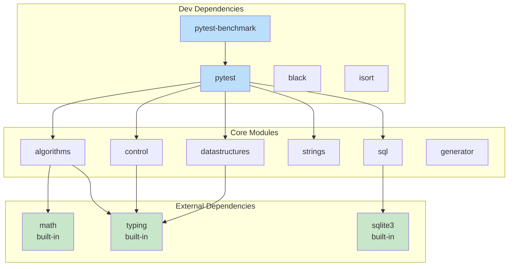

## Future Architecture Considerations

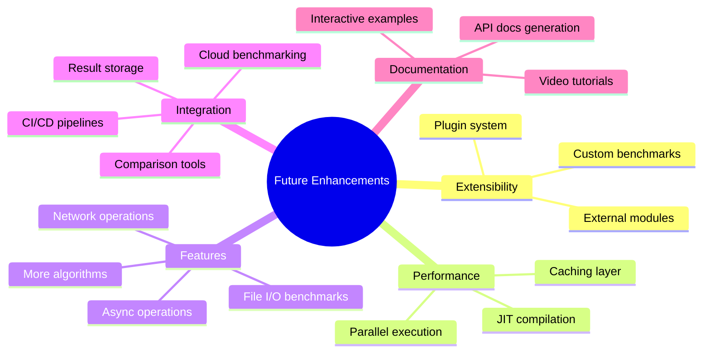

## Conclusion

The architecture of `llm-benchmarking-py` is designed for:
- **Simplicity**: Easy to understand and use
- **Modularity**: Clear separation of concerns
- **Testability**: Comprehensive test coverage
- **Performance**: Optimized implementations where it matters
- **Extensibility**: Easy to add new benchmarks

The use of static methods, modular organization, and comprehensive testing makes the library both a useful tool and a good reference implementation for benchmarking systems.

---

**Document Version:** 1.0  
**Last Updated:** 2024  
**Maintainers:** See [CONTRIBUTING.md](CONTRIBUTING.md)

For implementation details, see the source code. For contributing, see [CONTRIBUTING.md](CONTRIBUTING.md).
