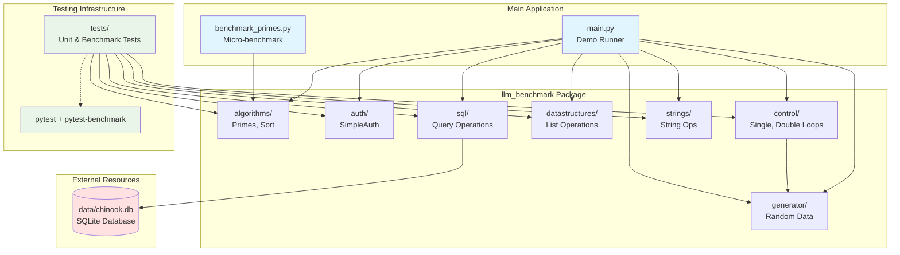

# llm-benchmarking-py

A comprehensive collection of Python functions designed to benchmark LLM (Large Language Model) projects and code generation capabilities. This library provides a diverse set of computational tasks across multiple domains to evaluate performance, correctness, and efficiency of generated code.

[](https://www.python.org/downloads/)
[](https://python-poetry.org/)
[](https://github.com/psf/black)

## Overview

This benchmarking suite tests various aspects of code generation and execution across multiple computational domains:

- **Algorithms** - Prime numbers, sorting, search algorithms
- **Control Flow** - Single/nested loops, conditionals
- **Data Structures** - List operations (modify, search, sort, reverse, rotate, merge)
- **String Operations** - Reversal, palindrome detection
- **Authentication** - Password hashing, token generation, validation
- **SQL Queries** - Database operations with SQLite (Chinook database)
- **Data Generation** - Random data utilities for testing

Perfect for evaluating LLM-generated code quality, performance characteristics, and algorithmic correctness.

## Features

### 🔢 Algorithms (`llm_benchmark.algorithms`)
- **Primes**: Prime number detection, prime summation, and prime factorization
- **Sort**: Sorting algorithms, Dutch flag partition, and finding max N elements

### 🔄 Control Flow (`llm_benchmark.control`)
- **SingleForLoop**: Single-loop operations for range sums, list maximums, and modulus operations
- **DoubleForLoop**: Nested loop operations for matrix sums, pair counting, and duplicate detection

### 📊 Data Structures (`llm_benchmark.datastructures`)
- **DsList**: List manipulation including modify, search, sort, reverse, rotate, and merge operations

### 🔤 String Operations (`llm_benchmark.strings`)
- **StrOps**: String reversal and palindrome detection

### 🔐 Authentication (`llm_benchmark.auth`)
- **SimpleAuth**: Password hashing and verification, token generation, username validation, password strength checking, and user authentication

### 🗄️ SQL Queries (`llm_benchmark.sql`)
- **SqlQuery**: Database operations including album queries, table joins, and invoice analysis using SQLite (Chinook database)

### 🎲 Generators (`llm_benchmark.generator`)
- **GenList**: Random list and matrix generation for testing purposes

## Table of Contents

- [Architecture](#architecture)
- [Installation](#installation)
- [Usage](#usage)
- [Module Documentation](#module-documentation)
- [Testing](#testing)
- [Project Structure](#project-structure)
- [Development](#development)
- [Contributing](#contributing)
- [License](#license)

## Architecture

The following diagram illustrates the high-level architecture of llm-benchmarking-py:



### Component Overview

- **Main Application**: Entry points for running demos and benchmarks
- **Core Modules**: Self-contained benchmarking functions organized by domain
- **Test Suite**: Comprehensive unit and performance tests using pytest
- **External Resources**: SQLite database for realistic SQL query testing

## Installation

### Prerequisites

- **Python 3.8+** - [Download Python](https://www.python.org/downloads/)
- **Poetry** - Python dependency management tool

### Installing Poetry

If you don't have Poetry installed:

```bash
# macOS/Linux/WSL
curl -sSL https://install.python-poetry.org | python3 -

# Windows PowerShell
(Invoke-WebRequest -Uri https://install.python-poetry.org -UseBasicParsing).Content | py -

# Alternative: using pip
pip install poetry
```

### Quick Start

1. **Clone the repository:**
   ```bash
   git clone <repository-url>
   cd llm-benchmarking-py
   ```

2. **Install dependencies:**
   ```bash
   poetry install
   ```
   
   This creates a virtual environment and installs all required packages.

3. **Verify installation:**
   ```bash
   poetry run pytest --benchmark-skip tests/
   ```

### Manual Setup (without Poetry)

If you prefer not to use Poetry:

```bash
# Create virtual environment
python -m venv venv

# Activate virtual environment
# On macOS/Linux:
source venv/bin/activate
# On Windows:
venv\Scripts\activate

# Install dependencies
pip install pytest pytest-benchmark black isort

# Note: This project has no runtime dependencies beyond Python stdlib
```

## Usage

### Running the Demo

Execute all benchmark functions with example data:

```bash
# Using Poetry (recommended)
poetry run main

# Or activate the shell first
poetry shell
python main.py
```

**Output**: Runs demonstrations of all modules (algorithms, control, SQL, auth, etc.) and displays results.

### Running Micro-benchmarks

Compare optimized vs original implementations:

```bash
poetry run python benchmark_primes.py
```

**Output**: Detailed performance comparison showing speedup metrics and complexity analysis.

### Using as a Library

Import and use individual modules in your code:

```python
from llm_benchmark.algorithms.primes import Primes
from llm_benchmark.control.single import SingleForLoop
from llm_benchmark.datastructures.dslist import DsList
from llm_benchmark.strings.strops import StrOps
from llm_benchmark.auth.simple_auth import SimpleAuth
from llm_benchmark.sql.query import SqlQuery

# Algorithm benchmarks
is_prime = Primes.is_prime(17)           # Returns: True
prime_sum = Primes.sum_primes(100)       # Returns: 1060
factors = Primes.prime_factors(84)       # Returns: [2, 2, 3, 7]

# Control flow benchmarks
total = SingleForLoop.sum_range(10)      # Returns: 45
maximum = SingleForLoop.max_list([1, 5, 3])  # Returns: 5

# Data structure operations
reversed_list = DsList.reverse_list([1, 2, 3, 4, 5])  # Returns: [5, 4, 3, 2, 1]
rotated = DsList.rotate_list([1, 2, 3, 4, 5], 2)      # Returns: [4, 5, 1, 2, 3]

# String operations
is_palindrome = StrOps.palindrome("racecar")  # Returns: True
reversed_str = StrOps.str_reverse("hello")    # Returns: "olleh"

# Authentication
hashed, salt = SimpleAuth.hash_password("SecurePass123")
is_valid = SimpleAuth.verify_password("SecurePass123", hashed, salt)  # Returns: True
token = SimpleAuth.generate_token(16)         # Returns: random 16-char token

# SQL queries (requires data/chinook.db)
exists = SqlQuery.query_album("Presence")     # Returns: True/False
albums = SqlQuery.join_albums()               # Returns: list of tuples
invoices = SqlQuery.top_invoices()            # Returns: top 10 invoices
```

### Integration Example

Use in your LLM evaluation pipeline:

```python
from llm_benchmark.algorithms.primes import Primes
from llm_benchmark.generator.gen_list import GenList

# Generate test data
test_data = GenList.random_list(100, 1000)

# Test generated code against benchmark
def evaluate_llm_generated_function(func, test_cases):
    """Evaluate LLM-generated code."""
    passed = 0
    for test_input, expected_output in test_cases:
        try:
            result = func(test_input)
            if result == expected_output:
                passed += 1
        except Exception as e:
            print(f"Error: {e}")
    return passed / len(test_cases)

# Use benchmark as ground truth
test_cases = [(n, Primes.is_prime(n)) for n in range(100)]
accuracy = evaluate_llm_generated_function(llm_generated_is_prime, test_cases)
print(f"Accuracy: {accuracy:.2%}")
```

## Testing

The project includes comprehensive unit tests and performance benchmarks using pytest and pytest-benchmark.

### Quick Test Commands

```bash
# Run all unit tests (fast, skips benchmarks)
poetry run pytest --benchmark-skip tests/

# Run only performance benchmarks (slow)
poetry run pytest --benchmark-only tests/

# Run everything (tests + benchmarks)
poetry run pytest tests/

# Run with verbose output
poetry run pytest -v tests/

# Run specific module tests
poetry run pytest tests/llm_benchmark/algorithms/
poetry run pytest tests/llm_benchmark/control/

# Run specific test file
poetry run pytest tests/llm_benchmark/algorithms/test_primes.py

# Run with coverage report
poetry run pytest --cov=llm_benchmark tests/
```

### Understanding Test Output

**Unit Test Output:**
```
tests/llm_benchmark/algorithms/test_primes.py::test_is_prime PASSED     [ 33%]
tests/llm_benchmark/algorithms/test_primes.py::test_sum_primes PASSED   [ 66%]
tests/llm_benchmark/algorithms/test_primes.py::test_prime_factors PASSED [100%]
```

**Benchmark Output:**
```
----------------------- benchmark: 3 tests -----------------------
Name (time in us)             Min      Max     Mean    Median
-----------------------------------------------------------------
test_benchmark_is_prime      5.1      8.2     5.5      5.4
test_benchmark_sum_primes   125.3   150.6   132.8    131.9
-----------------------------------------------------------------
```

### Test Structure

Tests mirror the source structure:
```
tests/
└── llm_benchmark/
    ├── algorithms/test_primes.py
    ├── control/test_single.py
    ├── control/test_double.py
    ├── datastructures/test_dslist.py
    ├── sql/test_query.py
    └── strings/ (tests to be added)
```

For detailed testing documentation, see [tests/README.md](tests/README.md).

## Module Documentation

### Algorithms
- `Primes.is_prime(n)` - Check if a number is prime
- `Primes.is_prime_ineff(n)` - Inefficient prime check (for benchmarking)
- `Primes.sum_primes(n)` - Sum all primes from 0 to n
- `Primes.prime_factors(n)` - Get prime factorization
- `Sort.sort_list(v)` - Sort a list in-place
- `Sort.dutch_flag_partition(v, pivot)` - Partition list around pivot
- `Sort.max_n(v, n)` - Find the N largest elements

### Control Flow
- `SingleForLoop.sum_range(n)` - Sum numbers from 0 to n
- `SingleForLoop.max_list(v)` - Find maximum in list
- `SingleForLoop.sum_modulus(n, m)` - Sum numbers divisible by m
- `DoubleForLoop.sum_square(n)` - Sum of squares using nested loops
- `DoubleForLoop.sum_triangle(n)` - Triangular number sum
- `DoubleForLoop.count_pairs(v)` - Count unique pairs in list
- `DoubleForLoop.count_duplicates(v1, v2)` - Count duplicates between lists
- `DoubleForLoop.sum_matrix(m)` - Sum all matrix elements

### Data Structures
- `DsList.modify_list(v)` - Add 1 to each element
- `DsList.search_list(v, n)` - Find all indices of value
- `DsList.sort_list(v)` - Sort and return copy
- `DsList.reverse_list(v)` - Reverse and return copy
- `DsList.rotate_list(v, n)` - Rotate list by n positions
- `DsList.merge_lists(v1, v2)` - Merge two lists

### String Operations
- `StrOps.str_reverse(s)` - Reverse a string
- `StrOps.palindrome(s)` - Check if string is palindrome

### Authentication
- `SimpleAuth.hash_password(password, salt)` - Hash a password with salt
- `SimpleAuth.verify_password(password, hashed, salt)` - Verify password against hash
- `SimpleAuth.generate_token(length)` - Generate secure random token
- `SimpleAuth.validate_username(username, min_length, max_length)` - Validate username format
- `SimpleAuth.check_password_strength(password)` - Check password strength
- `SimpleAuth.create_user(username, password)` - Create user with validated credentials
- `SimpleAuth.authenticate_user(username, password, stored_hash, stored_salt)` - Authenticate user

### SQL Queries
- `SqlQuery.query_album(name)` - Check if album exists
- `SqlQuery.join_albums()` - Join Album, Artist, and Track tables
- `SqlQuery.top_invoices()` - Get top 10 invoices by total

## Project Structure

```
llm-benchmarking-py/
├── src/
│   └── llm_benchmark/
│       ├── algorithms/      # Algorithm implementations
│       ├── auth/           # Authentication utilities
│       ├── control/         # Control flow operations
│       ├── datastructures/  # Data structure operations
│       ├── generator/       # Test data generators
│       ├── sql/            # SQL query operations
│       └── strings/        # String manipulation
├── tests/                  # Unit tests and benchmarks
├── data/                   # Database files (Chinook SQLite)
├── main.py                # Demo script
└── pyproject.toml         # Project configuration
```

## Build Instructions

### Building for Distribution

While this is primarily a library/benchmark suite, you can build it for distribution:

```bash
# Build wheel and source distribution
poetry build

# Output will be in dist/
# - llm_benchmark-0.1.0-py3-none-any.whl
# - llm_benchmark-0.1.0.tar.gz
```

### Installing from Source

```bash
# Install in development mode
poetry install

# Install without dev dependencies
poetry install --no-dev

# Install from built wheel
pip install dist/llm_benchmark-0.1.0-py3-none-any.whl
```

### Running without Installation

You can run the benchmarks directly:

```bash
# Add src to PYTHONPATH
export PYTHONPATH="${PYTHONPATH}:${PWD}/src"
python main.py

# Or use Python's -m flag
python -m main
```

## Development

### Development Workflow

1. **Activate Poetry shell:**
   ```bash
   poetry shell
   ```

2. **Make your changes** to source files

3. **Format code:**
   ```bash
   poetry run black src/ tests/
   poetry run isort src/ tests/
   ```

4. **Run tests:**
   ```bash
   poetry run pytest --benchmark-skip tests/
   ```

5. **Run benchmarks** (optional):
   ```bash
   poetry run pytest --benchmark-only tests/
   ```

### Code Style

- **Formatter**: Black (line length: 88)
- **Import sorting**: isort
- **Type hints**: Required for all function signatures
- **Docstrings**: Google-style docstrings for all public functions

```bash
# Check formatting without changes
poetry run black --check src/ tests/

# Format all code
poetry run black src/ tests/ && poetry run isort src/ tests/
```

### Adding New Benchmarks

See [CONTRIBUTING.md](CONTRIBUTING.md) for detailed instructions on:
- Adding new modules
- Writing benchmark functions
- Creating tests
- Documentation requirements

## Contributing

Contributions are welcome! We appreciate your help in making this project better.

### How to Contribute

1. **Fork the repository**
2. **Create a feature branch** (`git checkout -b feature/amazing-feature`)
3. **Make your changes** following our code style guidelines
4. **Add/update tests** for your changes
5. **Ensure all tests pass** (`poetry run pytest tests/`)
6. **Format your code** (`poetry run black . && poetry run isort .`)
7. **Commit your changes** (`git commit -m 'Add amazing feature'`)
8. **Push to your branch** (`git push origin feature/amazing-feature`)
9. **Open a Pull Request**

For detailed contribution guidelines, please see [CONTRIBUTING.md](CONTRIBUTING.md).

### Development Resources

- **README.md** (this file) - Project overview and usage
- **CONTRIBUTING.md** - Contribution guidelines and development setup
- **OPTIMIZATION.md** - Performance optimization documentation
- **CHANGES.md** - Changelog and version history
- **tests/README.md** - Testing documentation

## Documentation

- [Module Documentation](#module-documentation) - API reference for all modules
- [Testing Guide](tests/README.md) - Comprehensive testing documentation
- [Contributing Guide](CONTRIBUTING.md) - Development and contribution guidelines
- [Optimization Guide](OPTIMIZATION.md) - Performance optimization details
- [Changelog](CHANGES.md) - Version history and changes

## Related Files

- **OPTIMIZATION.md** - Details about performance improvements (O(n²) → O(n log log n))
- **CHANGES.md** - Summary of optimizations and changes
- **benchmark_primes.py** - Micro-benchmark demonstrating optimizations

## Performance Notes

This project includes several performance optimizations:

- **Prime algorithms**: Optimized from O(n²) to O(n log log n) using Sieve of Eratosthenes
- **Primality testing**: Optimized from O(n) to O(√n)
- See [OPTIMIZATION.md](OPTIMIZATION.md) for detailed performance analysis

## License

See project repository for license information.

## Author

**Matthew Truscott** (matthew.truscott@turintech.ai)

---

**Ready to get started?** Run `poetry install` and `poetry run main` to see all benchmarks in action!
